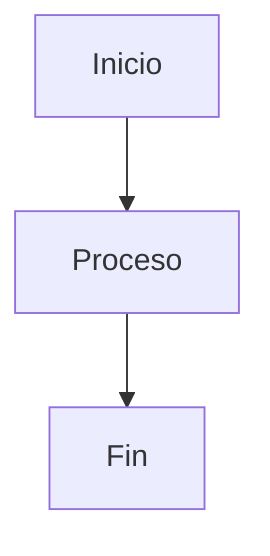

# 📒 Chuleta Markdown para GitHub

## 🔹 Encabezados
```markdown
# Título 1
## Título 2
### Título 3
#### Título 4
##### Título 5
###### Título 6
```

# Título 1  
## Título 2  
### Título 3  
#### Título 4  
##### Título 5  
###### Título 6  

---

## 🔹 Estilos de texto
```markdown
**Negrita**
*Cursiva*
***Negrita y cursiva***
~~Tachado~~
<u>Subrayado</u>   <!-- solo con HTML -->
<sup>Superíndice</sup>
<sub>Subíndice</sub>
```

**Negrita**  
*Cursiva*  
***Negrita y cursiva***  
~~Tachado~~  
<u>Subrayado</u>  
X<sup>2</sup> → Superíndice  
H<sub>2</sub>O → Subíndice  

---

## 🔹 Listas

### Lista ordenada
```markdown
1. Elemento 1
2. Elemento 2
   1. Sub-elemento
```

1. Elemento 1  
2. Elemento 2  
   1. Sub-elemento  

### Lista desordenada
```markdown
- Elemento A
- Elemento B
  - Sub-elemento
```

- Elemento A  
- Elemento B  
  - Sub-elemento  

---

## 🔹 Citas
```markdown
> Esto es una cita
>> Cita anidada
```

> Esto es una cita  
>> Cita anidada  

---

## 🔹 Código
```markdown
`código en línea`

\`\`\`bash
# bloque de código con lenguaje
echo "hola"
\`\`\`
```

`código en línea`  

```bash
# bloque de código con lenguaje
echo "hola"
```

---

## 🔹 Enlaces
```markdown
[Texto del enlace](https://github.com)
```

[Texto del enlace](https://github.com)

---

## 🔹 Imágenes
```markdown

```


---

## 🔹 Tablas
```markdown
| Columna 1 | Columna 2 | Columna 3 |
|-----------|-----------|-----------|
| Texto A   | Texto B   | Texto C   |
| Texto D   | Texto E   | Texto F   |
```

| Columna 1 | Columna 2 | Columna 3 |
|-----------|-----------|-----------|
| Texto A   | Texto B   | Texto C   |
| Texto D   | Texto E   | Texto F   |

---

## 🔹 Separador
```markdown
---
```

---

---

## 🔹 Listas de tareas (checklist)
```markdown
- [x] Tarea hecha
- [ ] Tarea pendiente
```

- [x] Tarea hecha  
- [ ] Tarea pendiente  

---

## 🔹 Emojis
Usa `:nombre:` → [Lista oficial aquí](https://github.com/ikatyang/emoji-cheat-sheet)  

Ejemplo:
```markdown
:smile: :rocket: :+1:
```

😄 🚀 👍  

---

## 🔹 HTML extra (soportado en GitHub)
```markdown
<u>Subrayado</u>
<span style="color:red">Texto rojo</span>
<p align="center">Texto centrado</p>
```

<u>Subrayado</u>  
<span style="color:red">Texto rojo</span>  
<p align="center">Texto centrado</p>  

---

## 🔹 Detalles desplegables
```markdown
<details>
  <summary>Haz clic aquí</summary>
  Texto oculto dentro del desplegable.
</details>
```

<details>
  <summary>Haz clic aquí</summary>
  Texto oculto dentro del desplegable.
</details>

---

## 🔹 Diagramas (Mermaid en GitHub)
```markdown
\`\`\`mermaid
graph TD;
    A[Inicio] --> B[Proceso];
    B --> C[Fin];
\`\`\`
```


